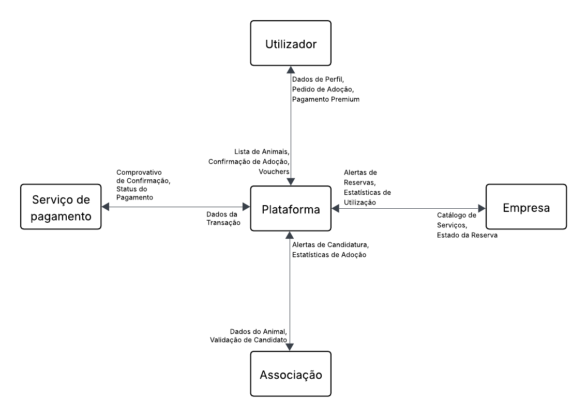
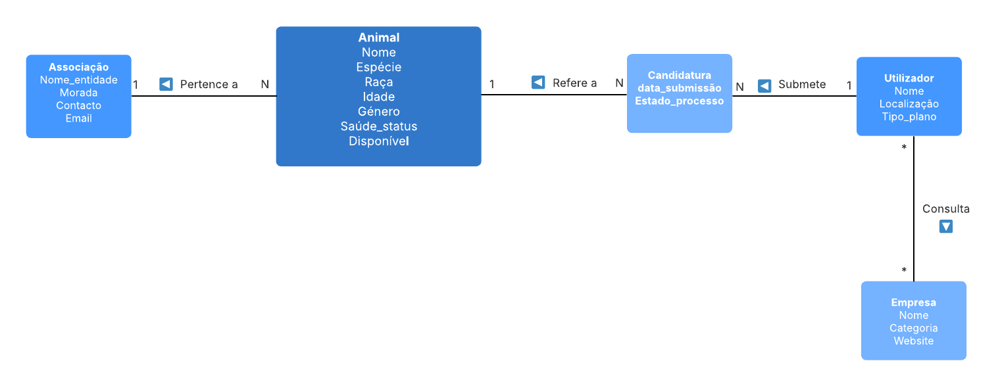

# Engenharia de Software aplicada ao Bem-Estar Animal

Este projeto apresenta a análise e especificação de software para uma plataforma integrada de adoção animal e rede de benefícios.

## Visão do Projeto
A plataforma visa profissionalizar o processo de adoção, conectando associações a adotantes, enquanto integra parceiros comerciais (veterinários e hotéis) num modelo de subscrição premium.

## Estrutura da Documentação
O planeamento completo está organizado no **Notion**, cobrindo:
- **Modelo de Domínio:** Estrutura de dados e relações entre Entidades.
- **Diagrama de Contexto:** Fluxos de informação com sistemas externos (Pagamentos/Parceiros).
- **Especificação de Requisitos:** Levantamento funcional e não funcional (MoSCoW).
- **Plano de Testes:** Casos de teste de aceitação.

## Componentes do Sistema
- **Frontend:** Framework moderna baseada em componentes.
- **Backend:** API REST escalável.
- **Base de Dados:** Relacional SQL para integridade de transações.
- **Infraestrutura:** Cloud Storage para media e Gateway de pagamentos externa.

---
🔗 **[Link para a Documentação Detalhada no Notion](https://hazel-spring-915.notion.site/Plataforma-de-Ado-o-e-Servi-os-para-Animais-310eaade78f1805e9130d4f0890740a9?source=copy_link)**

